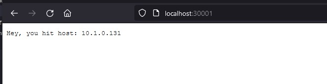
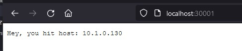
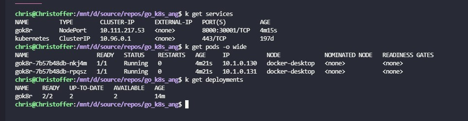

# gok8r

> A k8s/minikube project to practice helm deployments, rolling updates, load balancing and cluster networking.

This project uses a minimal Go API implementation and an Angular frontend. Static files are hosted /w nginx. The project is setup to package k8s yaml templates into helm charts which are found under `project-root/gok8r/packages`.The helm charts are then installed onto a single node minikube cluster. The beauty of helm charts is that it makes semantic versioning, rolling updates, and rollbacks an easy task.

To get started, build the images using the build script, and run `'helm install gok8r ./gok8r/packages/gok8r-0.1.0.tgz'` and a loadbalanced API with two replicas will be available through a nodeport at [localhost:30001](http://localhost:30001).

## Building the docker images

```./build.sh api frontend```

## Running containers outside of cluster

```./build.sh run api frontend```


## Example - Load balancing between two pods in a node.

Replica 1  
   

Replica 2  
 

Service/deployment setup  

 