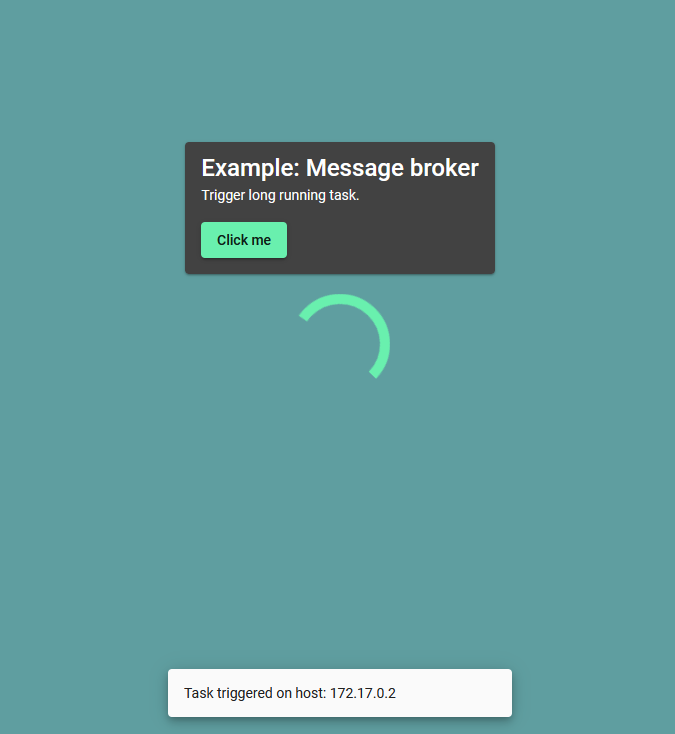
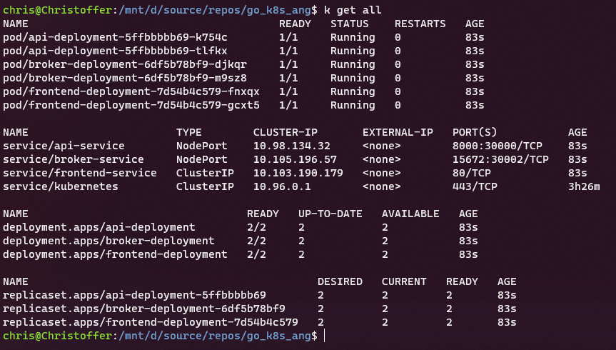

# gok8r

> A k8s project to practice helm deployments, rolling updates, load balancing and cluster networking.

This project uses a minimal Go API implementation and an Angular frontend. Static files are hosted /w nginx. 
The project is setup to package k8s yaml templates into helm charts which are found under `project-root/gok8r/packages`.
The helm charts are then installed onto a single node cluster. 
The beauty of helm charts is that it makes semantic versioning, rolling updates, and rollbacks an easy task.

To get started, build the images using the build script, then run them in Docker or follow the instructions below to
install it to a Kubernetes cluster.

## Building the docker images

```./build.sh api frontend broker```

## Running containers outside of cluster

```./build.sh -r api frontend broker```

## Installing cluster /w Helm

In order for the deployment to work for a local environment, the chosen ingress hostname needs to be mapped to
the hosts file in ```/etc/hosts``` on Linux, or ```C:\Windows\System32\drivers\etc\hosts``` for Windows.

Secondly, an ingress controller is needed for the defined ingresses. I recommend using helm to install nginx with:
```
helm upgrade --install ingress-nginx ingress-nginx \
  --repo https://kubernetes.github.io/ingress-nginx \
  --namespace <some namespace> --create-namespace
```

Lastly, run ```helm install gok8r ./gok8r/packages/gok8r-0.1.0.tgz```. If everything went well, you should be
able to access the cluster through [http://gok8r.local](http://gok8r.local).


## Example 1 - Load balancing between two pods in a node

Frontend  


Replica 1  
   

Replica 2  
 

Service/deployment setup  

 