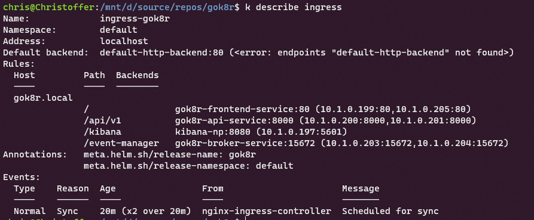
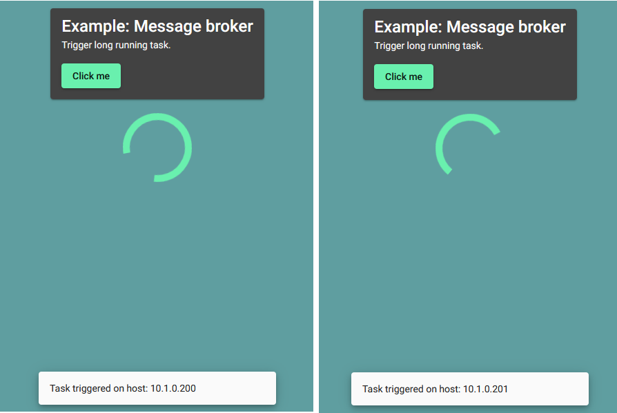
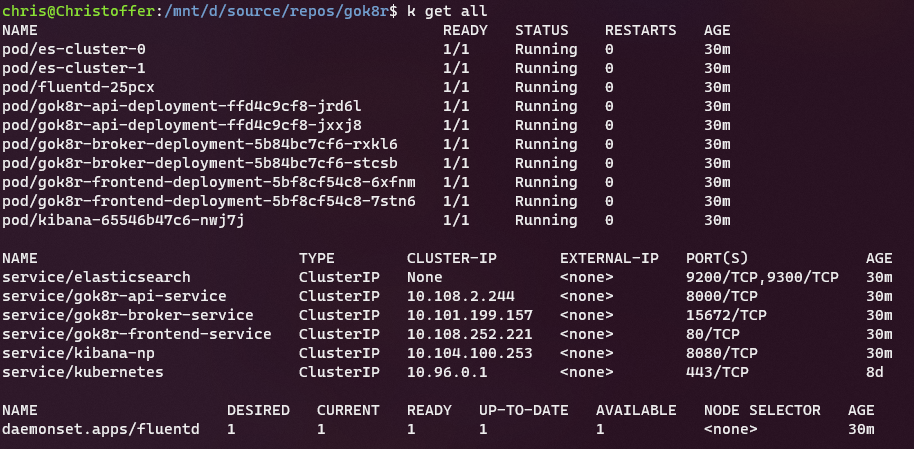
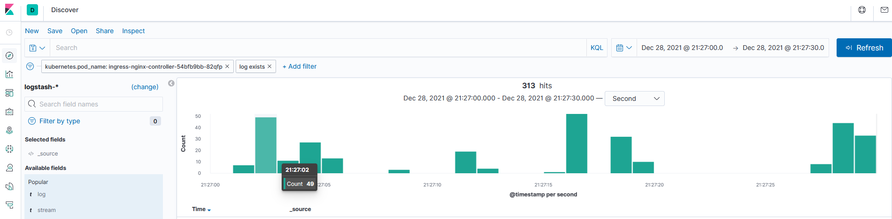
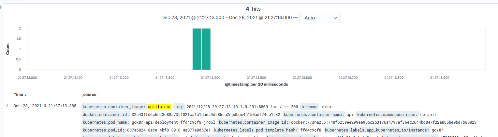

# gok8r

> A k8s project to practice helm deployments, rolling updates, load balancing and cluster networking.

This project uses a minimal Go API implementation and an Angular frontend. Static files are hosted /w nginx. 
The project is setup to package k8s yaml templates into helm charts which are found under `project-root/gok8r/packages`.
The helm charts are then installed onto a single node cluster. 
The beauty of helm charts is that it makes semantic versioning, rolling updates, and rollbacks an easy task.

To get started, build the images using the build script, then run them in Docker or follow the instructions below to
install it to a Kubernetes cluster.

# Table of Contents

1. [Setup for Docker](#setup_docker)
2. [Setup for Kubernetes](#setup_kubernetes) 
3. [Example images](#examples)
   1. [Ingress configuration](#ingress)
   2. [Load balancing](#loadbalancing)
   3. [Cluster setup](#cluster)
   4. [Log visualization](#kibana)


<div id='features'/>  

## Additional features

The microservices in this application consist of an Angular frontend using Material, a tiny Go API, and a logging stack
known as EFK (elasticsearch-fluentd-kibana). The fluentd log-collector is configured to run as a daemonset, and is
injected into each pod. This allows all output to **stderr**, and **stdout** to be collected, and passed to elasticsearch
running in the cluster. The logs from all pods are centralized to a single stateful elasticsearch db, and
can be visualized using the Kibana instance.

<div id='setup_docker'/>

## Building the docker images

```./build.sh api frontend broker```

## Running containers outside of cluster

```./build.sh -r api frontend broker```

<div id='setup_kubernetes'/>

## Installing cluster /w Helm

In order for the deployment to work for a local environment, the chosen ingress hostname needs to be mapped to
the hosts file in ```/etc/hosts``` on Linux, or ```C:\Windows\System32\drivers\etc\hosts``` for Windows.

Secondly, an ingress controller is needed for the defined ingresses. I recommend using helm to install nginx with:
```
helm upgrade --install ingress-nginx ingress-nginx \
  --repo https://kubernetes.github.io/ingress-nginx \
  --namespace <some namespace> --create-namespace
```

Lastly, run ```helm install gok8r ./gok8r/packages/gok8r-0.1.0.tgz```. If everything went well, you should be
able to access the cluster through [http://gok8r.local](http://gok8r.local).


<div id='examples'/>

## Examples

<div id='ingress'/>

### Ingress configuration



<div id='loadbalancing'/>

### Load balancing between two API pods in a node



<div id='cluster'/>

### Cluster setup


<div id='kibana'/>

### Log visualization with Kibana

#### HTTP requests count


#### API calls from frontend

